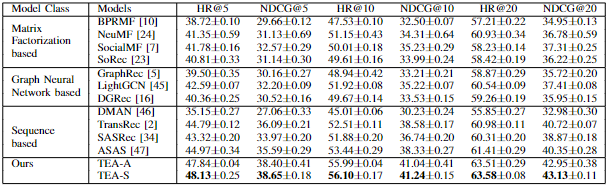
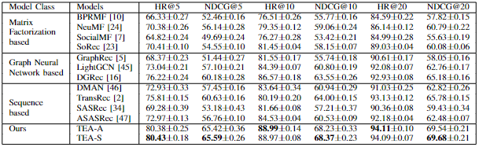

# TEA: A Sequential Recommendation Framework via Temporally Evolving Aggregations
## Requirements  
python 3.6  
torch 1.9  
numpy 1.19

## Quick Start  
The experiment uses the Yelp and Epinions data sets. Data preprocessing is required before training.  Here uses yelp as an example
```
python my_preprocess_yelp.py
```
TEA can be trained afterwards  
```
python run_gatmeta_tea_gat_yelp.py #TEA-A
python run_gatmeta_tea_gsage_yelp.py #TEA-S
```
The training method of the baseline in the paper is similar  

## Experiment Result  
### Epinions  
  
### Yelp

